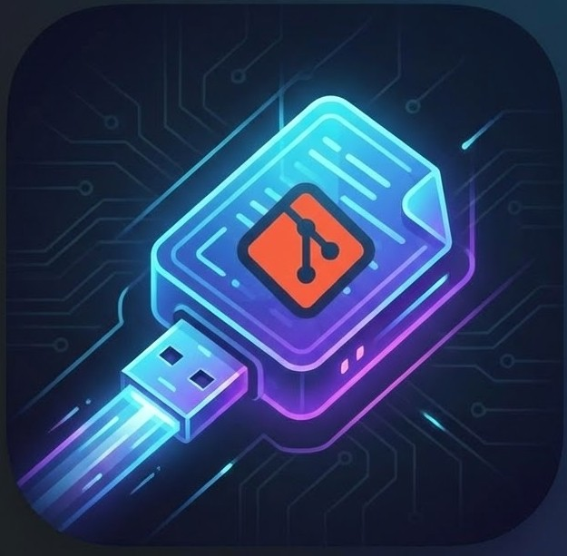
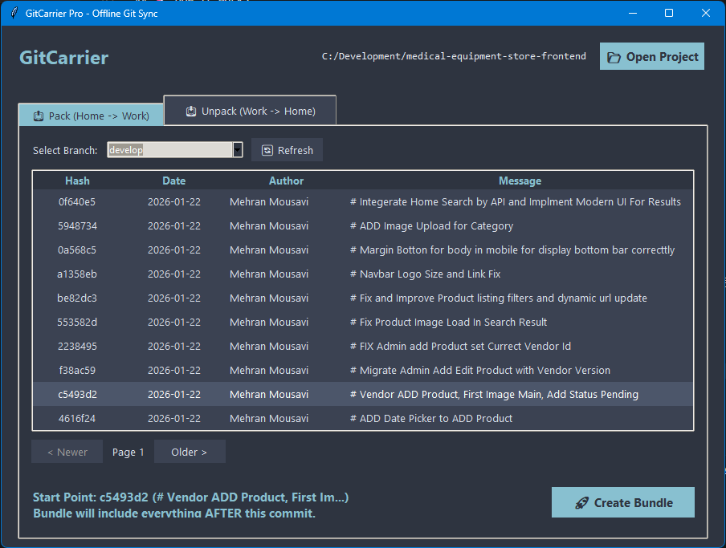

<div align="center">

  

  # GitCarrier
  **The Missing Link for the Disconnected Developer**

  [](https://www.python.org/)
  [](https://github.com/)
  [](LICENSE)
  [](https://github.com/)

  <p align="center">
    <b>Sync your repositories across air-gapped environments without losing a single commit hash.</b><br />
    <i>No Internet? No GitHub? No Problem.</i>
  </p>

  <a href="#installation"><strong>Get Started »</strong></a>
  <br />
  <br />

</div>

---

## 📖 The Story: Why I Built This

**Connectivity is a privilege, but code must flow.**

I faced a unique challenge: I was developing complex software in a fragmented environment. My workstation at the office was air-gapped (or disconnected) from my home setup. GitHub was inaccessible.

I tried the "classic" methods: zipping project folders, manually copying changed files, or emailing patches. The result? **Chaos.** Merge conflicts, lost history, broken builds, and the nightmare of trying to remember *"Did I change `utils.py` at home or at work?"*

I realized that **Git** is decentralized by design, yet we've become dependent on centralized servers like GitHub.

I built **GitCarrier** to reclaim that independence. It leverages the powerful but often forgotten `git bundle` protocol to package your entire commit history—or just the incremental changes—into a single file. It turns your flash drive into a legitimate Git remote.

It’s not just a script; it’s a bridge for developers who refuse to let infrastructure limits stop their innovation.

---

## ✨ Features

GitCarrier wraps complex Git commands in a **premium, modern GUI** designed for speed and safety.

* **🎨 Modern Dark UI:** Built with a custom Nord-themed interface that feels professional and easy on the eyes.
* **🧠 Smart Context Awareness:** Automatically detects your repository, active branch, and commit history.
* **⚡ Incremental Bundling:** Don't copy the whole repo. Select a "Base Commit," and GitCarrier packages *only* what's new.
* **🛡️ Auto-Verification:** Never carry a broken file. The app verifies the bundle integrity instantly after creation.
* **📦 Zero Dependencies:** Written in pure Python using `tkinter`. No `pip install` required. Runs on any machine with Python installed.
* **💾 Portable Settings:** Saves your preferences on the go, perfect for running directly from a USB drive.

---

## 📸 Screenshots

<div align="center">
  
  <br/>
  <br/>
  <em>The Pack Interface: Select your starting point visually and generate bundles safely.</em>
</div>

---

## 🚀 How It Works

### Scenario: Moving from Home 🏠 to Office 🏢

1.  **At Home (Pack):**
    * Open GitCarrier and select your project.
    * Choose the last commit that exists at your Office.
    * Click **Create Bundle**.
    * Save the `.bundle` file to your USB drive.

2.  **At Office (Unpack):**
    * Plug in the USB.
    * Open GitCarrier (running directly from the USB).
    * Go to the **Unpack** tab.
    * Select the bundle file.
    * Click **Merge**.
    * *Voila!* Your office repo is now perfectly synced with your home work, history included.

---

## 🛠️ Installation & Usage

Since GitCarrier is designed to be portable, there is no complex installation.

### Prerequisites
* Python 3.x installed.
* Git installed and added to your system PATH.

### Running the App
```bash
# 1. Clone the repository (Replace with your actual repo URL)
git clone [https://github.com/mehran-mousavi/GitCarrier.git](https://github.com/mehran-mousavi/GitCarrier.git)

# 2. Navigate to the folder
cd GitCarrier

# 3. Run the application
python git_carrier.py

```

---

## 🏗️ Architecture & Tech Stack

This project demonstrates how to build robust desktop tools using standard libraries:

* **Language:** Python 3
* **GUI Framework:** `tkinter` & `ttk` with custom styling (No heavy external UI libs).
* **Concurrency:** Uses `threading` to keep the UI responsive during heavy Git operations.
* **Pattern:** Strict separation of concerns (Logic vs. UI) for maintainability.

---

## 🤝 Contributing

Contributions are what make the open source community such an amazing place to learn, inspire, and create. Any contributions you make are **greatly appreciated**.

1. Fork the Project
2. Create your Feature Branch (`git checkout -b feature/AmazingFeature`)
3. Commit your Changes (`git commit -m 'Add some AmazingFeature'`)
4. Push to the Branch (`git push origin feature/AmazingFeature`)
5. Open a Pull Request

---

## 📝 License

Distributed under the MIT License. See `LICENSE` for more information.

---

<div align="center">
<p>If this tool saved your workflow, please give it a ⭐️!</p>
<p>Made with ❤️ by [Mehran Mousavi]</p>
</div>